# 🏛️ HRISP — Manila City Council HRIS


**Human Resource Information System for the City Council of Manila** — a server-rendered Java/Spring Boot web application that manages government employee **201 files**: Personal Data Sheets (CS Form 212), service records, appointments, clearances, trainings, and a **multi-role leave workflow** (CS Form 6 + leave cards), with PDF generation through **JasperReports**.

🌐 **Live:** https://manilacitycouncil.com &nbsp;•&nbsp; 🗃️ Backend: Spring Boot on `:8082`, MySQL database `hris_01`


---

## 📑 Table of contents

- [✨ Highlights](#-highlights)
- [🖼️ Product tour](#%EF%B8%8F-product-tour)
- [🧭 Modules](#-modules)
- [👥 Roles & access control](#-roles--access-control)
- [🛠️ Tech stack](#%EF%B8%8F-tech-stack)
- [🚀 Getting started](#-getting-started)
- [📁 Repository layout](#-repository-layout)
- [📚 Documentation](#-documentation)
- [🔒 Security notes](#-security-notes)

---

## ✨ Highlights

- 🗂️ **Complete 201-file management** — employee master list, PDS (CS Form 212) with 9 editable sections, service records, appointments, clearances, trainings, and a document archive (SALN / resigned / past leaves).
- 🌴 **Approval-chain leave workflow** — HR screening → Supervisor endorsement → Council review → Vice-Mayor final approval, with per-stage notifications, appeal/cancel, leave-card balance ledger and monthly accruals.
- 🖨️ **Government form output** — 30 JasperReports templates print CS Form 6, Leave Card, PDS, Clearance (CSC Form), Service Record, Report on Separation and more.
- 🔐 **Six role types, server-enforced** — BCrypt passwords, own-record authorization guards, restricted approver queues, session-scoped notifications.
- 🗄️ **Auditable schema evolution** — 15 numbered SQL migrations under `src/main/resources/migrations`.
- ⚙️ **Admin-configurable** — 20+ lookup-maintenance CRUD screens (leave types, signatories, salary grades, eligibilities, schools…) so HR can adapt the system without code changes.
- 📅 **Year-end processing** — idempotent Dec-31 mandatory/forced-leave deduction with coterminous exclusion, plus an on-demand HR run.

---

## 🖼️ Product tour

> Screenshots below were captured from the running application (admin, HR, employee, supervisor, council and vice-mayor accounts).

### 🔐 Sign-in & role-based dashboards

**Login** — form login with BCrypt-backed Spring Security:

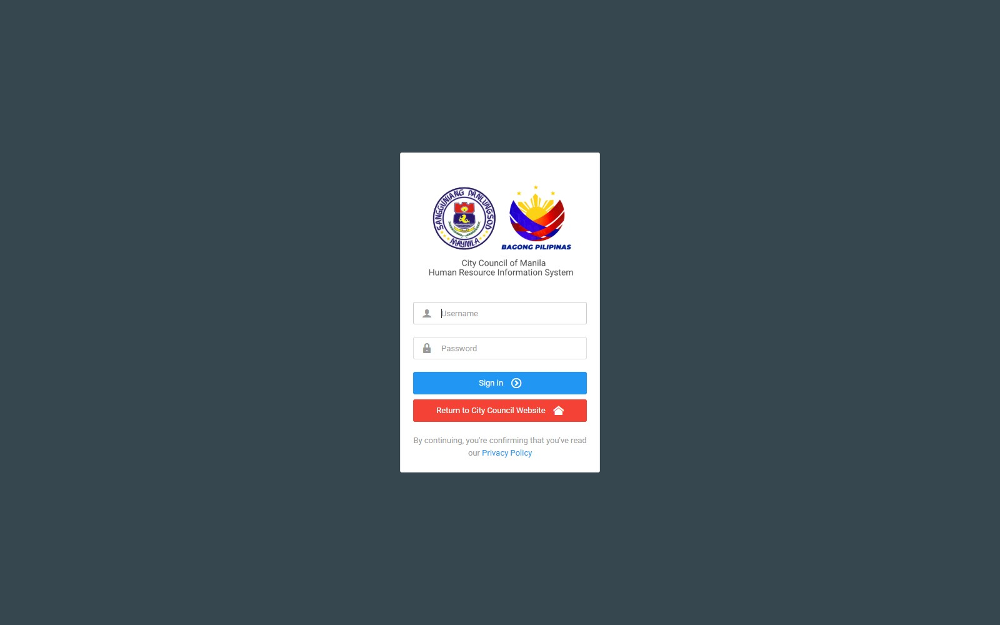

**HR / Admin dashboard** — workload at a glance:

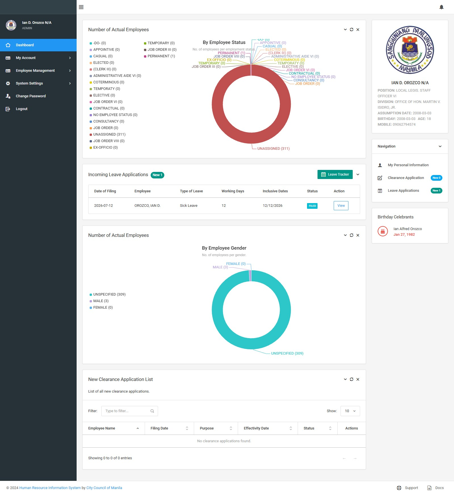

**Employee self-service dashboard** (My Account menu):

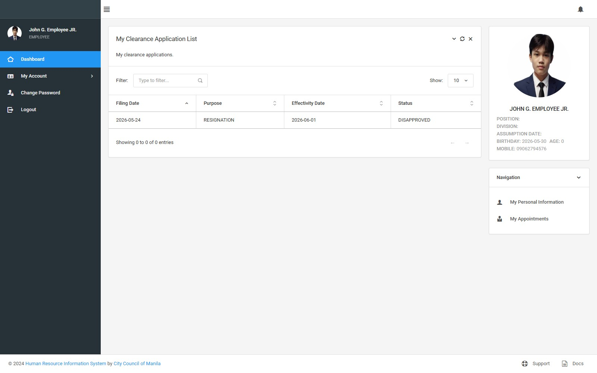

### 🌴 Leave management

**Employee list of CS Form 6 applications** + leave card ledger:

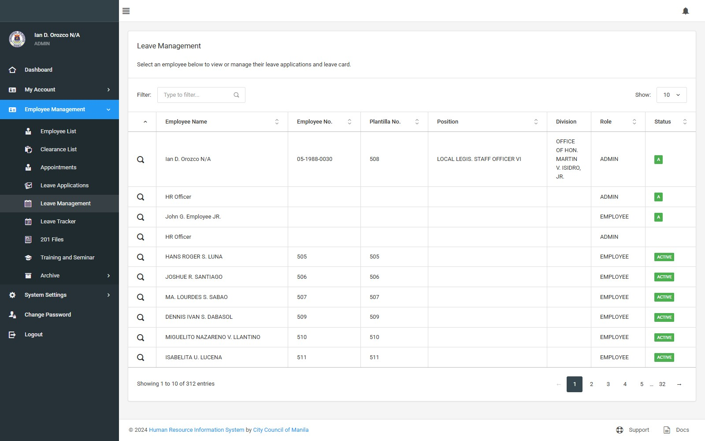

**HR decision-flow queue** — screening, endorsement and year-end mandatory/forced leave processing:

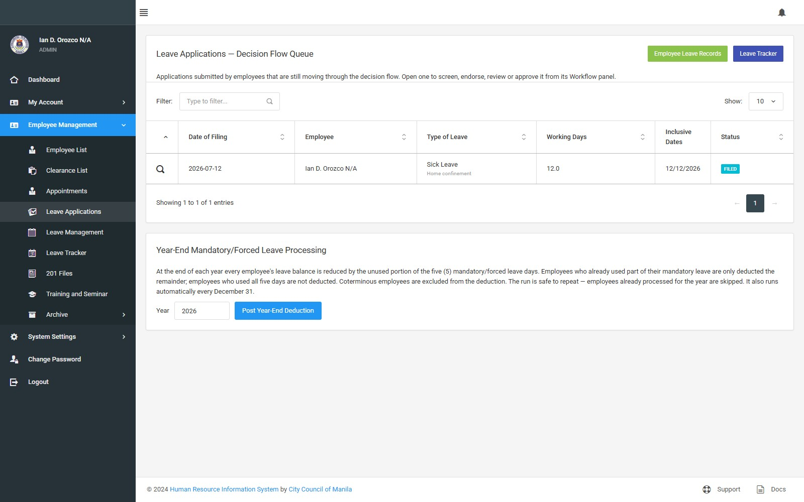

**CSC signatory chain** printed on CS Form 6:

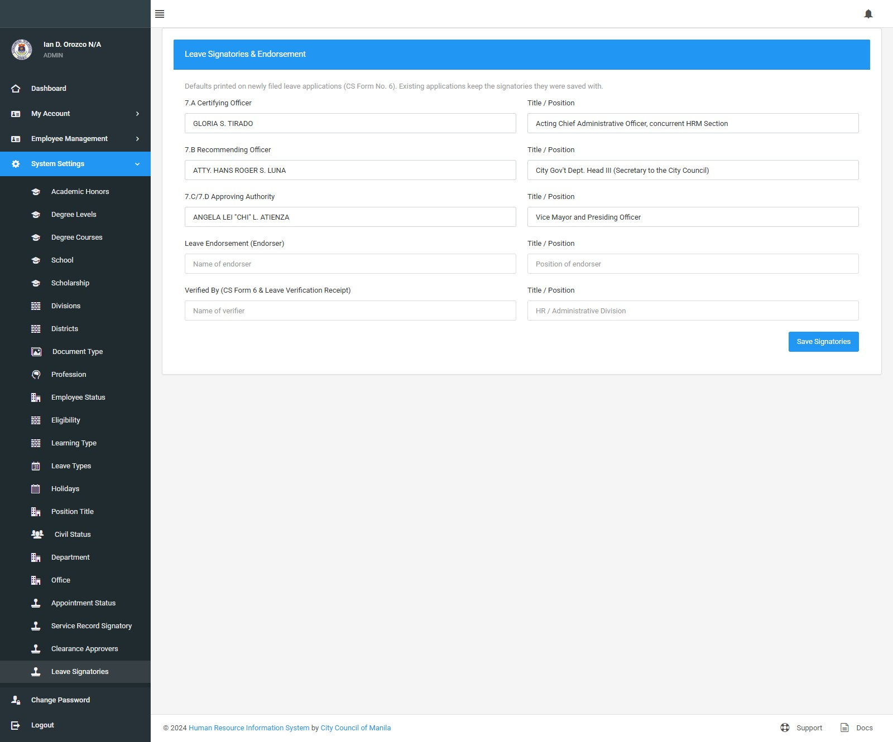

### 🤝 Multi-role approval

**Supervisor — "Leaves Awaiting Your Action"** (endorse / deny / return-to-HR):

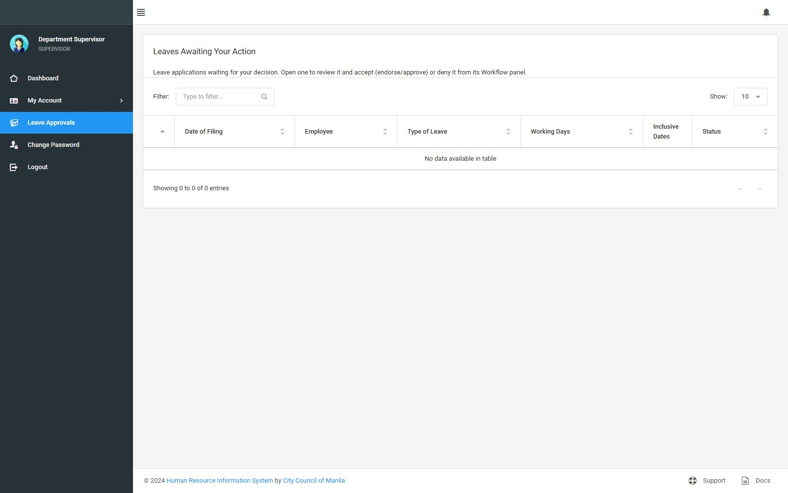

**Vice-Mayor — final approval** for leaves ≥ 15 days:

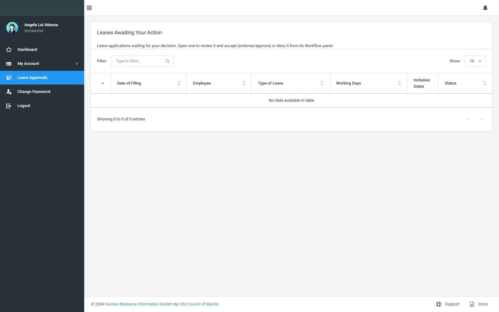

### 🗂️ 201 files

**Per-employee document uploads by document type:**

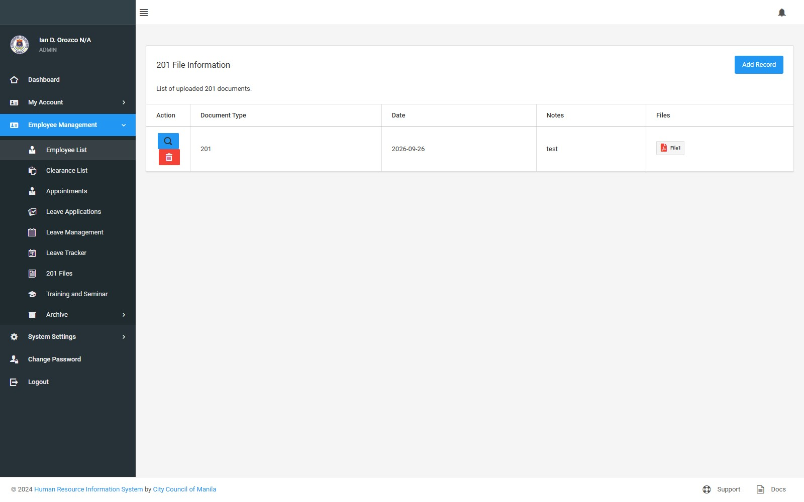

### 📄 Personal Data Sheet (CS Form 212)

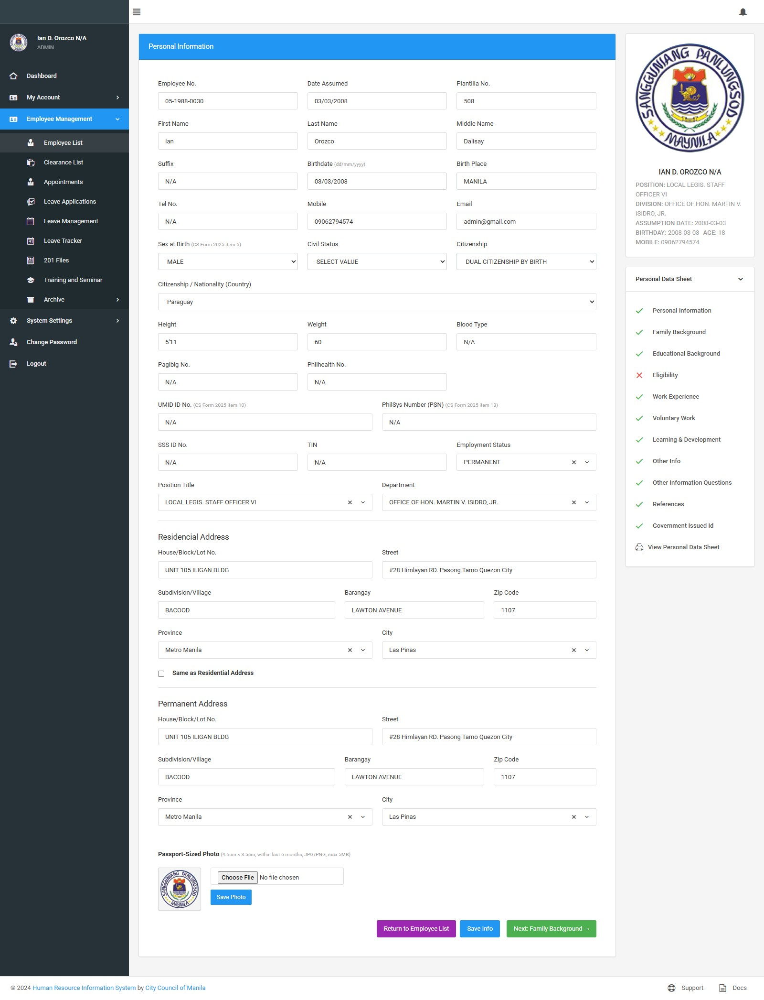

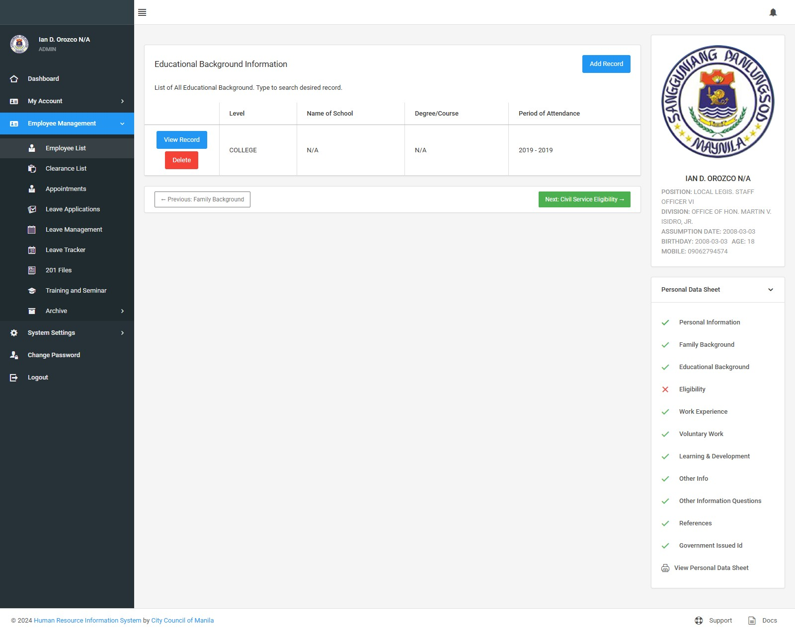

### 📊 Reports (JasperReports)

**CS Form No. 6 — Application for Leave**, generated as PDF from Jasper:

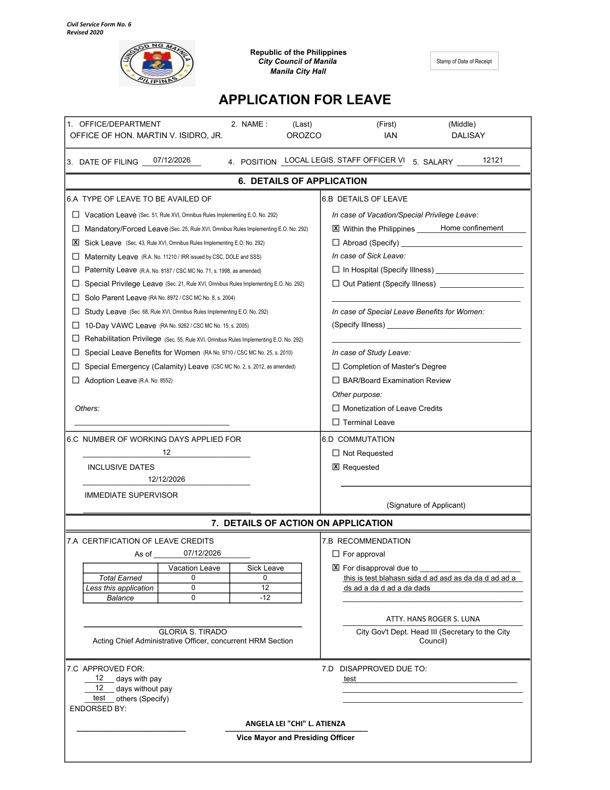

### ⚙️ System settings

**Lookup maintenance** (here: leave types) — one of 20+ admin CRUD screens:

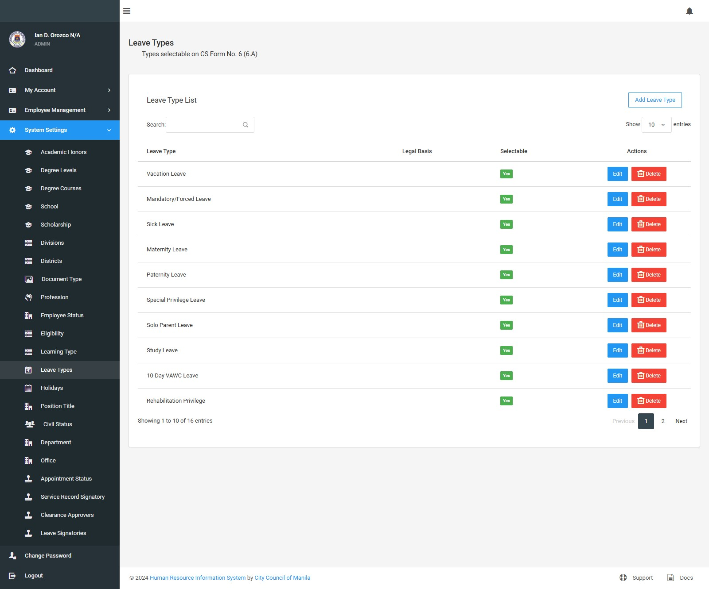

---

## 🧭 Modules

Authoritative per-module flows (including Mermaid diagrams) live in
[`docs/HRIS_PROCESS_FLOWS.md`](docs/HRIS_PROCESS_FLOWS.md).

| # | Module | What it does |
|---|---|---|
| 🔐 | **1. Login, accounts & roles** | `employee` records hold username, BCrypt password and a single `user_type` role; legacy plain-text passwords are re-encoded on first successful login. Role assignment & password reset from Employee List. |
| 🧑‍💼 | **2. Employee records (201 file core)** | Create/edit employees, photo upload, credentials, status, plantilla/appointment details. |
| 📄 | **3. Personal Data Sheet (PDS)** | 9 CS Form 212 sections, admin editing + employee self-service behind an own-record guard; searchable dropdowns; prints to PDF with `N/A` for empty fields. |
| 🌴 | **4. Leave management** | Full CR-016-v2 decision flow, docs gate, verification receipts, leave-card ledger, monthly accrual (1.25 VL / 1.25 SL), leave tracker calendar, CS Form 6 export. |
| 🧾 | **5. Clearance** | Employee-filed applications, per-approver sign-offs, approval PDF, configurable approver/signatory settings. |
| 📇 | **6. Service records & appointments** | HR-maintained position/office/salary/period history; employees view their own; prints the CSC Service Record form. |
| 🎓 | **7. Training & seminar** | Trainings/seminars with provider, hours, dates and certificate uploads — feeds PDS Learning & Development. |
| 🗃️ | **8. 201 files & archive** | Per-employee document uploads by type; HR-only archive of SALN, resigned-employee and past leave documents. |
| 🔔 | **9. Notifications** | In-app navbar bell with unread badge; produced by the leave decision flow; strictly session-scoped. |
| 🖨️ | **10. Reports & PDF exports** | JasperReports: PDS, CS Form 6, Leave Card, Leave Verification Receipt, Clearance, Service Record, Report on Separation, individual employee reports. |
| ⚙️ | **11. System settings** | 20+ CRUD screens (departments, offices, districts, position titles + PDFs, salary grades, levels, statuses, degrees, honors, schools, scholarships, professions, eligibilities, document types, learning types, leave types, holidays, signatories). |
| 📅 | **12. Year-end processing** | Scheduled (Dec 31, 23:30) or manual run: deduct unused mandatory days for eligible employees, skipping non-ACTIVE and coterminous staff; idempotent per year. |

---

## 👥 Roles & access control

Spring Security form login (`/login`) with BCrypt hashes; authorization is enforced per route.

| Role | Purpose | Lands on |
|---|---|---|
| 🔑 `ROLE_ADMIN` | Full system administration | Dashboard |
| 🧑‍💻 `ROLE_HR` | HR records management, leave screening, every workflow stage | Dashboard |
| 👤 `ROLE_EMPLOYEE` | Self-service: own PDS, clearance, service record, leave | Dashboard (My Account menu) |
| ✅ `ROLE_SUPERVISOR` | Endorses / denies / returns-to-HR leaves awaiting endorsement | **Leave Approvals** |
| 🏛️ `ROLE_COUNCIL` | Secretary to the City Council — council review of docs-required leaves; finalizes < 15-day leaves | **Leave Approvals** |
| 🎩 `ROLE_VICEMAYOR` | Final approval / denial of leaves ≥ 15 days | **Leave Approvals** |

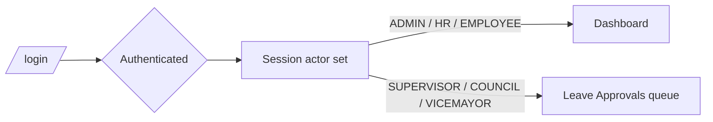

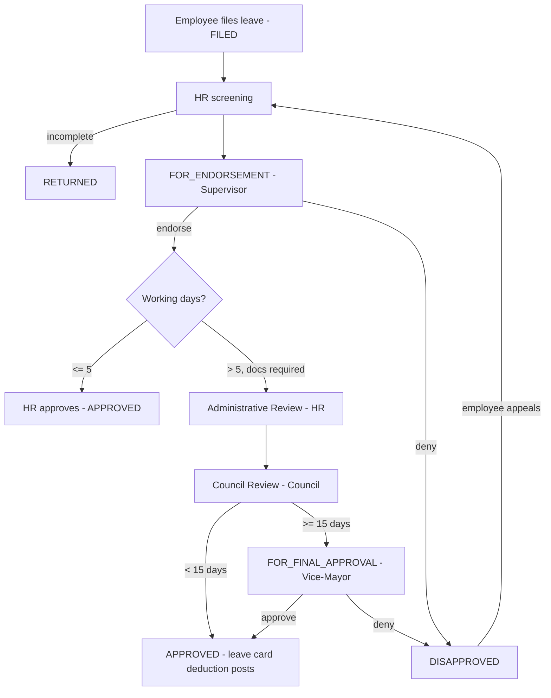

---

## 🛠️ Tech stack

| Component | Version / notes |
|---|---|
| ☕ **Java** | Target **11** (`java.version` in `pom.xml`); compiles on **JDK 11 / 21 / 25** and runs on **JDK 21 / 25** (Lombok ≥ 1.18.42 required for JDK 21+) |
| 🍃 **Spring Boot** | `2.2.4.RELEASE` — Web, Data JPA, Data REST, Security, Thymeleaf, Mail, DevTools |
| 🔐 **Security** | Spring Security form login, BCrypt, per-role route authorization, own-record guards |
| 🗄️ **Database** | MySQL (`hris_01`), Spring Data JPA / Hibernate, 15 SQL migrations |
| 🎨 **UI** | Thymeleaf templates (62 screens) on a Limitless/Bootstrap theme — no front-end build step |
| 🖨️ **Reporting** | JasperReports **6.20** — 30 `.jasper` templates, 11 editable `.jrxml` sources, compiled during the Maven build |
| 📦 **Packaging** | Fat **WAR** (`target/hrisp.war`) with embedded Tomcat — also deployable to an external container |
| 🧰 **Build** | Maven 3.x (**no `mvnw` wrapper in this repo**) |
| 🔧 **Utilities** | Lombok, MapStruct, opencsv, Apache Commons Lang3 |

---

## 🚀 Getting started

### Prerequisites

- **JDK 11+** (verified on 11, 17, 21 and 25)
- **Maven 3.x** installed locally — there is **no Maven wrapper** in this repo
- **MySQL 5.7 / 8.x** on `localhost:3306`

### Run locally (dev profile)

```bash
# Dev profile is the default: src/main/resources/application.properties
mvn clean spring-boot:run

# then open http://localhost:8082/login
```

> 💡 Works on modern JDKs: the Lombok version in `pom.xml` (1.18.42) is what keeps
> annotation processing working on JDK 21/25, where `sun.misc.Unsafe` was removed.

### Build the WAR

```bash
mvn clean package -DskipTests   # -> target/hrisp.war (~90 MB), recompiles .jrxml -> .jasper
java -jar target/hrisp.war
```

### Configuration & profiles

`src/main/resources/application.properties` selects the profile via
`SPRING_PROFILES_ACTIVE` (default `dev`):

- **dev** — `application-dev.properties`. Local DB overrides (passwords) belong in
  `config/application-dev.properties`, which is **git-ignored** and auto-loaded from the working directory.
- **prod** — `application-prod.properties`. Reads `DB_USERNAME` (default `cdsiadmin`) and `DB_PASSWORD`
  from the environment. Uploads go to `/hrisp/uploads`.
- `EMPLOYEE_DEFAULT_PASSWORD` sets the default password assigned to new employee accounts
  (falls back to `ChangeMe123`).

### Deploy to production

```bash
bash deploy.sh
```

`deploy.sh` is the authoritative ops entry point (build → scp → md5 verify → restart) and reads
the target host from an environment variable. The server launches the fat WAR from
`~/hrisp-web01/target/hrisp.war` via `~/hrisp-web01/restart.sh`, so the WAR must land at exactly
that path. Treat `deploy.sh` as the source of truth for server address/SSH key — older docs under
`docs/deployment/` mention superseded IPs. Nginx + Let's Encrypt reference:
`docs/deployment/nginx-hrisp.conf`.

---

## 📁 Repository layout

| Path | Contents |
|---|---|
| `src/` | Application source — Java under `com.ian.web`, Thymeleaf templates, Jasper templates, SQL migrations |
| `deploy.sh` | Build + deploy script (primary ops entry point) |
| `docs/changes/` | Change logs and assessment reports for past feature work |
| `docs/deployment/` | Deployment checklist, SSH upload guide, summary, nginx config, data-migration guide |
| `docs/leave/` | Leave module blueprint + source leave-processing documents |
| `docs/reference/` | Blank CSC PDS forms and Excel templates |
| `docs/uat/` | Final UAT documents and admin/employee UAT screenshots |
| `scripts/` | Data import/export utilities (`export_pds_to_csv.sh`, `import_employees.py`, `gen_councilors.py`) + screenshot tooling |
| `archive/` | Legacy material kept for reference (PDS/JRXML calibration scripts, superseded UAT drafts); not needed to build or run |
| `config/` | **Git-ignored** local Spring Boot overrides (local DB password) |

> `readMeAssets/` holds the screenshots embedded above — see
> [`readMeAssets/INDEX.md`](readMeAssets/INDEX.md) for the full 73-shot manifest
> (file → screen → route → role).

---

## 📚 Documentation

| Document | Contents |
|---|---|
| [`docs/HRIS_PROCESS_FLOWS.md`](docs/HRIS_PROCESS_FLOWS.md) | All 12 modules with Mermaid flow diagrams |
| [`docs/leave/LEAVE_PROCESS_FLOW.md`](docs/leave/LEAVE_PROCESS_FLOW.md) | Full leave decision flow incl. per-role authorization and balances |
| `docs/uat/` | UAT sign-off documents and reference screenshots |
| `docs/deployment/` | Deployment runbook, checklist and nginx config |
| `docs/changes/` | CR/change-request history (CR-015, CR-016 v2, CR-017, CR-020 …) |

---

## 🔒 Security notes

- Passwords are stored as **BCrypt** hashes; legacy plain-text rows are re-encoded on first login.
- Database credentials are supplied through **environment variables** or the **git-ignored**
  `config/` directory — never hardcode them, and keep it that way.
- Report/attachment routes that take an id (e.g. `/leaveForm6Pdf/{id}`) are guarded against IDOR
  with per-record hash tokens; employee self-service routes enforce an own-record check.
- Screenshots under `readMeAssets/` and in `docs/uat/` are **development/UAT captures** of a
  local dev database; they are included for documentation purposes only and are not a live
  data source.
